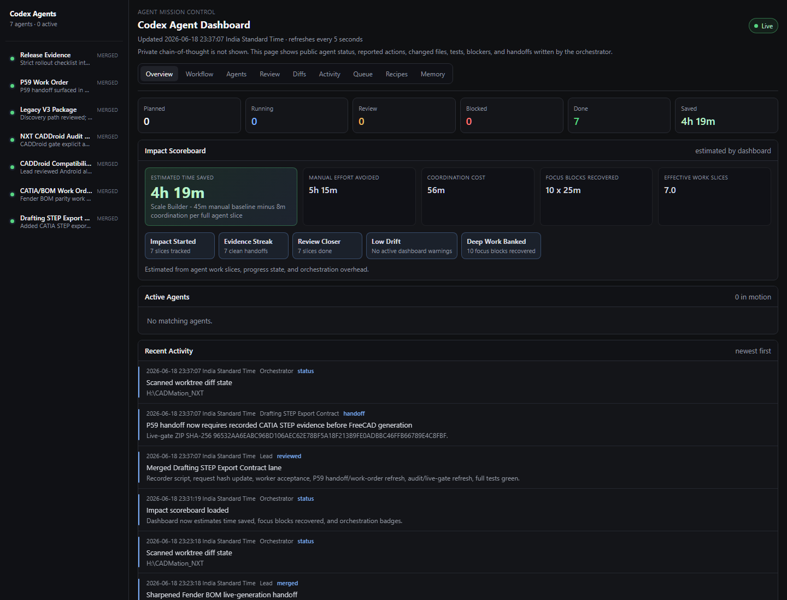

<p align="center">
  
</p>

<h1 align="center">Codex Agent Dashboard Skill</h1>

<p align="center">
  A local-first mission control dashboard for running serious multi-agent Codex coding workflows.
</p>

<p align="center">
  <a href="https://github.com/bhupendrafire-ai/codex-agent-dashboard-skill">
    
  </a>
  
  
  
</p>

---

## Why This Exists

Codex can run complex work across many agents, but large agent swarms get messy fast:

- Which agents are running?
- Who owns which files?
- Which sessions are blocked?
- Which changes are ready for review?
- Which agents finished but never reported final evidence?
- Where did that handoff go?

This skill turns those loose threads into a live local cockpit: agents, lifecycle state, ownership, public activity, worktree intelligence, review gates, stale warnings, and second-brain export in one browser view.

It is intentionally not a replacement for the lead agent's judgment. It is the instrument panel that keeps the lead agent from flying blind.

## Highlights

| Capability | What it does |
| --- | --- |
| Live sidecar dashboard | Serves a local auto-refreshing dashboard at `http://127.0.0.1:8765/agent-dashboard.html`. |
| Multi-view cockpit | Includes `/overview`, `/workflow`, `/agents`, `/review`, `/diffs`, `/activity`, `/queue`, `/recipes`, `/memory`, and `/agent/<id>`. |
| Agent lifecycle tracking | Supports `planned`, `queued`, `running`, `completed`, `needs-review`, `reviewed`, `blocked`, `failed`, `merged`, and `closed`. |
| Robust JSON input | Uses JSON/file inputs for long summaries, paths, blockers, events, planned agents, and final reports. |
| Spawn reconciliation | Maps planned agents to real Codex session ids after `spawn_agent` returns. |
| Review gates | Prevents `reviewed` status unless changed files, tests, blocker evidence, and handoff are present. |
| Read-only scout mode | Lets explorer/scout agents pass review with `readOnly:true`, verification, blockers, and handoff without fake changed files. |
| Evidence-aware warnings | Treats complete review-ready rows as handoff evidence, infers read-only scout rows, and keeps write-scope warnings focused on active editing work. |
| Dashboard Doctor | Reports warnings, missing final reports, missing write scopes, stale commands, missing ids, blockers, and next actions. |
| Convergence check | Warns when the run has shifted from local code work to external/live evidence collection, so you stop spawning unhelpful repo-local agents. |
| Worktree intelligence | Scans git status, matches changes to owners, flags ownership violations, and ignores noisy build/cache artifacts. |
| Drift warnings | Surfaces stale running sessions, missing final reports, missing ids, and overlapping write globs. |
| Durable snapshots | Archives timestamped copies of dashboard JSON for post-run handoff or audits. |
| Impact scoreboard | Estimates time saved, focus blocks recovered, and unlocks lightweight workflow badges. |
| Second-brain export | Appends a durable run summary to an Obsidian-style daily note. |

## Quick Start

From this repo:

```powershell
py -3 .\scripts\agent_dashboard.py --serve --open
```

Default local URL:

```text
http://127.0.0.1:8765/agent-dashboard.html
```

The script writes its live state under:

```text
%LOCALAPPDATA%\CodexAgentDashboard\
```

## The Basic Loop

1. Start or reuse the live dashboard.
2. Plan agents before spawning them.
3. Give each agent a heartbeat contract.
4. Reconcile each real spawned session id back to its planned row.
5. Let agents publish public heartbeats at meaningful milestones.
6. Ingest final reports when agents finish.
7. Use the review gate before marking work reviewed.
8. Run the dashboard doctor and resolve hygiene gaps.
9. Archive a snapshot and export the run summary when the swarm is done.

## Impact Scoreboard

The dashboard includes a conservative impact estimate for humans: estimated time saved, manual effort avoided, coordination cost, focus blocks recovered, and small badges for healthy orchestration habits.

By default it uses an intentionally discounted estimate:

- `45m` manual work per full agent slice
- lower default manual credit for scouts, read-only rows, orchestration/meta rows, and rows without meaningful changed files
- `8m` coordination overhead per tracked slice
- `25m` per focus block

Tune it for your own workflow:

```powershell
py -3 .\scripts\agent_dashboard.py --keep-existing `
  --manual-minutes-per-agent 60 `
  --coordination-minutes-per-agent 10 `
  --focus-block-minutes 25 `
  --impact-note "Estimate uses one focused manual implementation slice per planned agent."
```

Agents can also report per-slice estimates in JSON. Explicit estimates are treated as already scoped and are not discounted by the default scout/meta heuristics:

```json
{
  "name": "Installer",
  "manualMinutes": 90,
  "coordinationMinutes": 12
}
```

The estimate is meant to make progress feel visible without claiming stopwatch precision. It is not billing data, and the dashboard says what assumptions it used.

Do not treat this score as completion evidence. The convergence check and your real gates/tests decide whether the run is actually done.

## Plan Agents

Use JSON for real work. Pipe strings still exist for tiny updates, but JSON survives long paths and text containing `|`.

```powershell
py -3 .\scripts\agent_dashboard.py --keep-existing `
  --workflow-objective "Harden release readiness" `
  --plan-agent-json '{
    "name": "Installer",
    "summary": "Harden installer gate",
    "ownership": "Installer/Auth boundary",
    "allowedFiles": ["src/Installer", "src/Auth"],
    "writeGlobs": ["src/Installer/**", "src/Auth/**"],
    "doNotTouch": ["src/Billing/**"],
    "expectedOutputs": ["changed files", "tests", "blockers", "handoff"],
    "tests": "installer smoke",
    "priority": "P1",
    "wave": "wave-1",
    "recipe": "release-readiness-matrix",
    "status": "queued"
  }'
```

For read-only explorer/scout agents, declare `readOnly:true`. They still need a scoped `ownership`/`allowedFiles`, verification notes, blocker status, and handoff, but they do not need `writeGlobs` or changed files.

```powershell
py -3 .\scripts\agent_dashboard.py --keep-existing `
  --plan-agent-json '{
    "name": "Release Evidence Scout",
    "summary": "Read release evidence and propose next slices",
    "ownership": "release docs and evidence artifacts",
    "allowedFiles": ["docs/**", "artifacts/release/**"],
    "readOnly": true,
    "expectedOutputs": ["findings", "risks", "handoff"],
    "tests": "read-only scan",
    "status": "queued"
  }'
```

## Publish Heartbeats

Agents should publish public progress only: no private reasoning, secrets, credentials, or raw personal data.

```powershell
py -3 .\scripts\agent_dashboard.py --keep-existing `
  --event-json '{
    "agent": "Installer",
    "kind": "test",
    "message": "Installer smoke passed",
    "detail": "Validated auth handoff and rollback path"
  }'
```

Update an agent row:

```powershell
py -3 .\scripts\agent_dashboard.py --keep-existing `
  --agent-json '{
    "name": "Installer",
    "id": "019...",
    "status": "running",
    "summary": "Patching installer release gate",
    "ownership": "Installer/Auth boundary",
    "changedFiles": ["src/Installer/Gate.cs"],
    "tests": "dotnet test src/Installer.Tests",
    "blockers": "None reported",
    "handoff": "Lead should review installer gate diff"
  }'
```

## Reconcile Spawned Session IDs

When a Codex spawn call returns the real session id:

```powershell
py -3 .\scripts\agent_dashboard.py --keep-existing `
  --reconcile-agent-id "Installer|019ed...|Installer"
```

That keeps planned rows, events, and future handoffs tied to the real running session.

## Ingest Final Reports

Final reports are the cleanest way to keep the dashboard from drifting away from truth.

```powershell
py -3 .\scripts\agent_dashboard.py --keep-existing `
  --final-report-json-file .\agent-final-report.json
```

Example final report:

```json
{
  "name": "Installer",
  "id": "019ed...",
  "status": "completed",
  "summary": "Installer release gate is hardened",
  "changedFiles": ["src/Installer/Gate.cs", "src/Auth/AuthProbe.cs"],
  "tests": "dotnet test src/Installer.Tests",
  "blockers": "None reported",
  "handoff": "Ready for lead review; watch rollback copy in Gate.cs",
  "events": [
    {
      "agent": "Installer",
      "kind": "handoff",
      "message": "Final report ready",
      "detail": "Changed files, verification, blockers, and handoff provided"
    }
  ]
}
```

Final reports set the agent to `needs-review` by default and record `lastFinalReportAt`.

Generate a template from a current row:

```powershell
py -3 .\scripts\agent_dashboard.py --print-final-report-template Installer
```

## Dashboard Doctor

Run the doctor before review, handoff, or closing a swarm:

```powershell
py -3 .\scripts\agent_dashboard.py --doctor
```

The doctor prints lifecycle counts, drift warnings, final-report gaps, missing write scopes, missing active ids, stale pending commands, critical blockers, a convergence check, and suggested next commands. The same report is available in the live dashboard at `/doctor`.

If the doctor says convergence is `external evidence needed`, stop starting more repo-local agents unless you find a new local gap. Collect the operator/live evidence, attach it to the run, then rerun the final gate.

Resolve a stale pending command after acting on it:

```powershell
py -3 .\scripts\agent_dashboard.py --keep-existing `
  --set-command-state "1738a5216292|dismissed|Superseded by newer handoff"
```

Archive the current dashboard JSON:

```powershell
py -3 .\scripts\agent_dashboard.py --keep-existing --archive-run-snapshot
```

## Review Gate

An agent cannot be marked `reviewed` unless it has:

- changed files
- tests or verification
- blocker evidence, even if the answer is `None reported`
- a handoff

When there is a blocker, prefer JSON and include `blockerType`: `local`, `external`, `mixed`, or `unclear`. Local blockers justify another implementation or debug agent. External blockers need live systems, credentials, operator action, hardware, signing proof, or returned evidence.

Read-only scouts with `readOnly:true` do not need changed files, because their output is analysis rather than edits.

For review-ready rows, changed files plus tests, blocker status, and handoff count as usable handoff evidence even if the row was not created through `--final-report-json-file`. The final-report command is still the cleanest path, but the dashboard avoids duplicate stale/drift warnings when equivalent evidence is already present. Active editing states still need planned edit paths.

This is deliberately strict. The dashboard should make integration safer, not just prettier.

## Worktree Scan

Scan a git worktree for changed files, ownership matches, overlap risk, and handoff readiness:

```powershell
py -3 .\scripts\agent_dashboard.py --keep-existing `
  --scan-worktree H:\CADMation_NXT
```

The scanner ignores noisy folders and artifacts by default:

- `.git`
- `bin`
- `obj`
- `node_modules`
- `.next`
- `dist`
- `build`
- `.venv`
- `__pycache__`
- `.pytest_cache`
- `.mypy_cache`
- common binary and media artifacts

Add run-specific ignores:

```powershell
py -3 .\scripts\agent_dashboard.py --keep-existing `
  --scan-worktree H:\CADMation_NXT `
  --scan-ignore "artifacts/**" `
  --scan-ignore "*.snap"
```

## Built-In Recipes

The skill includes reusable deployment recipes:

- `explorer-swarm`
- `implementation-workers`
- `test-fix-wave`
- `pr-review-response`
- `migration-refactor-split`
- `bug-investigation-ladder`
- `release-readiness-matrix`

Print one:

```powershell
py -3 .\scripts\agent_dashboard.py --print-recipe release-readiness-matrix
```

## Second-Brain Export

Append a durable run summary to your daily note:

```powershell
py -3 .\scripts\agent_dashboard.py --keep-existing --export-second-brain
```

Override the default vault path:

```powershell
$env:SECOND_BRAIN_VAULT = "C:\Users\you\Documents\second-brain"
```

Preview without writing:

```powershell
py -3 .\scripts\agent_dashboard.py --print-memory-summary
```

## Development Verification

Before syncing a changed skill install:

```powershell
py -3 -m unittest discover -s tests -v
py -3 -m py_compile scripts\agent_dashboard.py tests\test_agent_dashboard.py
py -3 .\scripts\agent_dashboard.py --doctor
```

Then smoke the live server route:

```text
http://127.0.0.1:8765/doctor
```

## Side Panel Etiquette

`--open` is idempotent for the dashboard URL. It records the open URL under:

```text
%LOCALAPPDATA%\CodexAgentDashboard\open-state.json
```

Use `--open` once when starting the dashboard. Do not pass it for every heartbeat or agent launch.

## Project Layout

```text
.
+-- SKILL.md
+-- agents/
|   +-- openai.yaml
+-- scripts/
|   +-- agent_dashboard.py
+-- docs/
|   +-- dashboard-screenshot.png
|   +-- dashboard-preview.svg
+-- tests/
    +-- test_agent_dashboard.py
```

## Philosophy

Good agentic coding is not just more agents. It is better coordination.

This dashboard is built around a few practical beliefs:

- Public status beats private guessing.
- Ownership should be declared before edits begin.
- Review should require evidence.
- A stale dashboard should admit it is stale.
- The lead agent still owns judgment.

## Status

This is an active personal Codex skill. It is useful today, opinionated by design, and likely to evolve as Codex orchestration surfaces expose richer runtime hooks.
